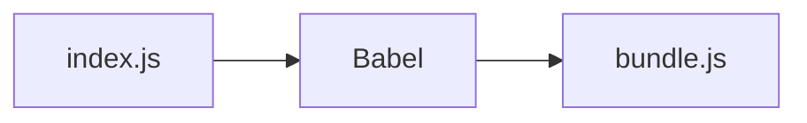

# Introduction

We can use the Babel tool to write code in the most recent JavaScript version. Babel will compile our code to a supported version for wider Browser compatibility.



In

```js
// ES2020 nullish coalescing
function greet(input) {
  return input ?? "Hello world";
}
```

Out

```js
function greet(input) {
  return input != null ? input : "Hello world";
}
```

[Source](https://github.com/babel/babel)


# Intallation

```shell
npm install -g babel-cli
babel --version
# 6.26.0 (babel-core 6.26.3)
cd babel
npm init
npm install babel-preset-env
```

# Resources

1. [Minimal Babel Setup](https://kheohyeewei.medium.com/minimal-babel-setup-b12b563ee2ca)
