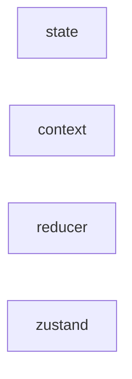

```mermaid
flowchart LR
    state
    context
    reducer
    zustand
```

# Resources

1. [mastering-context](https://github.com/jherr/mastering-context)
2. [Mastering React Context: Do you NEED a state manager?](https://www.youtube.com/watch?v=MpdFj8MEuJA)
